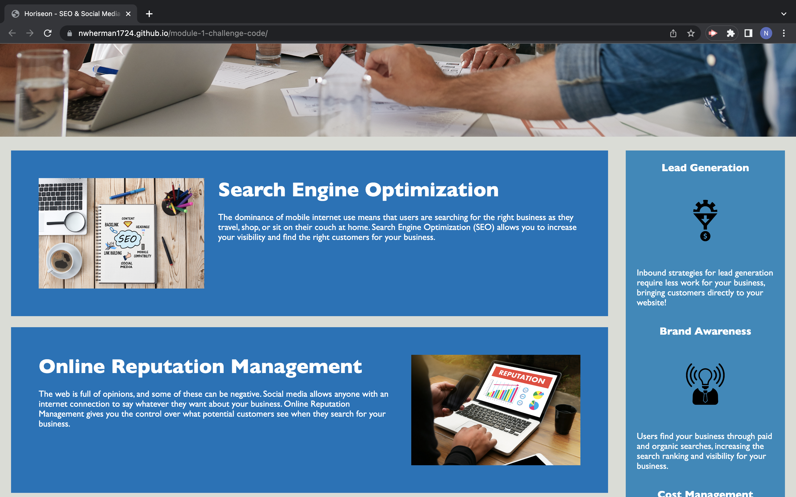

# Code Refactor Starter Code

## Table of Contents

- Description
- User Story
- Accceptance Criteria
- Assets
- Credits

## Description

This is the first Module challene int he MSU Full-Stack coding bootcamp. It will exercise knowledge of HTML, CSS, and Git/Github. THe objective of this project is to make changes to code that was provided to us to increase accessibility and optimize it for search engines. The user story and acceptance criteria for the project have their own sections below.

Github Pages Link: https://nwherman1724.github.io/module-1-challenge-code/

## User Story

* AS A marketing agency, I WANT a codebase that follows accessibility standards SO THAT our own site is optimized for search engines

## Acceptance Criteria

* It's done WHEN I view the source code and THEN I find semantic HTML elements

* It's done WHEN I view the structure of the HTML elements and THEN I find that the elements 
follow a logical structure independent of styling and positioning 

* It's done WHEN I view the image elements and THEN I find accessible alt attributes

* It's done WHEN I view the heading attributes and THEN they fall in sequential order

* It's done WHEN I view the title element and THEN I find a concise, descriptive title

* It's done WHEN I view the webpage and then the webpage meets accessibility standards

## Assets

- Screenshots

The following images are used throughout the website:

./assets/images/brand-awareness.png
./assets/images/cost-management.png
./assets/images/digital-marketing-meeting.jpg
./assets/images/lead-generation.png
./assets/images/online-reputation-management.jpg
./assets/images/search-engine-optimization.jpg
./assets/images/social-media-marketing.jpg

## Credits

Project provided by MSU Full-Stack Coding Bootcamp